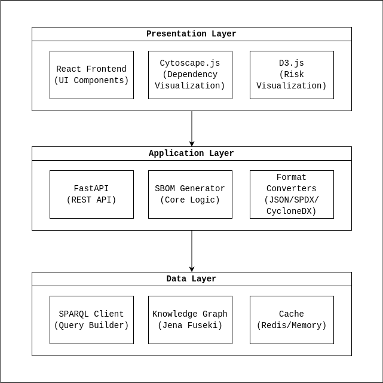

# SBOM Construction Tool Architecture

## Overview

The SBOM (Software Bill of Materials) Construction Tool is designed to extract software dependency information from the Secure Chain Knowledge Graph and generate standardized SBOM outputs. The tool provides a comprehensive view of software dependencies and associated vulnerabilities to support effective risk management of third-party components.

## System Architecture

The system follows a three-tier architecture:

1. **Data Layer**: Interfaces with the Knowledge Graph via SPARQL queries
2. **Application Layer**: Processes the data and constructs the SBOM
3. **Presentation Layer**: Visualizes the dependency tree and provides user interface



## Component Details

### Data Layer

1. **SPARQL Client**
   - Constructs and executes SPARQL queries against the Knowledge Graph
   - Handles query optimization and error handling
   - Implements query templates for common operations

2. **Knowledge Graph ([Jena Fuseki](https://jena.apache.org/documentation/fuseki2/))**
   - Stores the RDF data about software, dependencies, and vulnerabilities
   - Provides SPARQL endpoint for querying
   - Manages the ontology and data model

3. **Cache**
   - Stores frequently accessed query results
   - Improves performance for repeated queries
   - Implements time-based invalidation strategy

### Application Layer

1. **[FastAPI](https://fastapi.tiangolo.com/) (REST API)**
   - Provides HTTP endpoints for frontend communication
   - Handles request validation and error handling
   - Implements authentication and rate limiting

2. **SBOM Generator (Core Logic)**
   - Implements the core algorithm for dependency tree traversal
   - Processes query results into structured data
   - Handles circular dependency detection and resolution

3. **Format Converters**
   - Transforms internal SBOM representation to standard formats
   - Supports JSON, SPDX, and CycloneDX output formats
   - Validates output against schema specifications

### Presentation Layer

1. **[React](https://react.dev/) Frontend**
   - Provides user interface for input and configuration
   - Handles user interactions and form submissions
   - Implements responsive design for various devices

2. **[Cytoscape.js](https://js.cytoscape.org/)**
   - Visualizes dependency trees as interactive graphs
   - Provides zoom, pan, and filtering capabilities
   - Highlights vulnerable components

3. **[D3.js](https://d3js.org/)**
   - Creates risk heatmaps and scorecards
   - Visualizes vulnerability statistics
   - Generates exportable charts and reports

## Data Flow

1. User inputs a software name through the frontend
2. The request is sent to the FastAPI backend
3. The SBOM Generator initiates the process
4. The SPARQL Client queries the Knowledge Graph for:
   - Software information
   - Software versions
   - Dependencies for each version
   - Vulnerabilities for each dependency
5. Results are processed and transformed into an internal SBOM representation
6. The Format Converter generates the requested output format
7. The result is sent back to the frontend
8. Cytoscape.js visualizes the dependency tree
9. D3.js creates risk visualizations

## API Endpoints

```
GET /api/software/search?name={name}
- Search for software by name

GET /api/software/{id}/versions
- Get all versions of a specific software

GET /api/version/{id}/dependencies
- Get dependencies for a specific software version

GET /api/version/{id}/vulnerabilities
- Get vulnerabilities for a specific software version

POST /api/sbom/generate
- Generate SBOM for a given software name
- Parameters: software_name, format (json/spdx/cyclonedx)

GET /api/sbom/{id}
- Retrieve a previously generated SBOM
```

## Docker Containerization

The application will be containerized using Docker with the following containers:

1. **Frontend Container**
   - Node.js environment for React
   - Nginx for serving static files

2. **Backend Container**
   - Python environment with FastAPI
   - SBOM generation logic

3. **Fuseki Container**
   - Apache Jena Fuseki server
   - Pre-loaded with the Secure Chain Knowledge Graph

These containers will be orchestrated using Docker Compose for easy deployment and testing.

## Security Considerations

1. Input validation to prevent SPARQL injection
2. Rate limiting to prevent DoS attacks
3. Proper error handling to avoid information leakage
4. Secure API design with appropriate authentication if needed
5. Data validation for all inputs and outputs

## Performance Considerations

1. Query optimization for large dependency trees
2. Caching strategy for frequently accessed data
3. Pagination for large result sets
4. Asynchronous processing for long-running operations
5. Efficient graph traversal algorithms

## Future Extensions

1. Integration with other vulnerability databases
2. Support for additional SBOM formats
3. Batch processing capabilities
4. User-defined filtering and customization options
5. Export and sharing features
